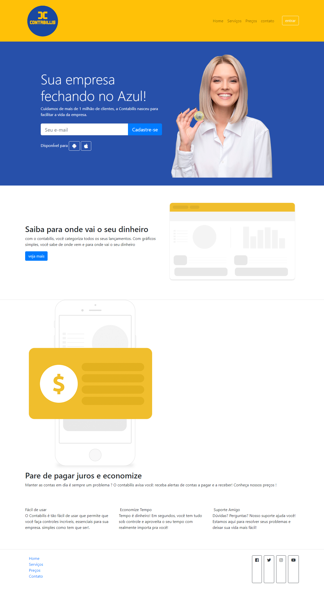

<h1 align="center">Contabilis - Seu Contador Digital</h1>

  

## 💻 Projeto

O Projeto é um desafio de montar o site (página única),  de uma empresa **fictícia** de contabilidade, usando Bootstrap, HTML5 e Css3, o projeto é para fins de praticar durante a aula da disciplina Desenvolvimento web I.

  <a href="#tecnologias">Tecnologias</a> •
  <a href="#layout">Layout</a> •
  <a href="#deploy">Deploy</a>•
  <a href="#Contribuindo">Contribuir</a>
  

## 🚀 Tecnologias

Desenvolvido com:

  <!--  -->
  
  
  
  

## 🔖 Layout

 

##  Deploy

Acesse o Contabilis agora mesmo [aqui.]()

## ️ Contribuindo

Contribuições são bem-vindas! Para contribuir com este projeto, siga estes passos:

1. Fork este repositório
2. Crie uma nova branch
3. Faça suas alterações
4. Crie um pull request

---

 
Feito com ❤️ por: <a href="https://linktr.ee/lucas.007"> Lucas Eduardo Rosolem</a>
